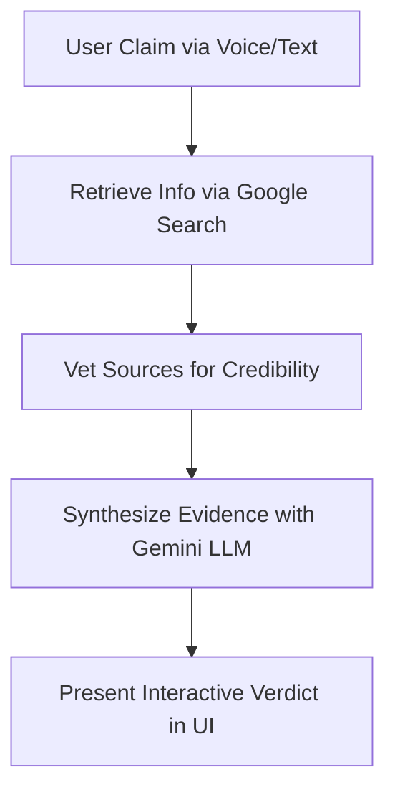

# 🔎 Automated Fact-Checker with Source Analysis

**A robust, multi-stage RAG pipeline that verifies claims against real-time web evidence, analyzes source credibility, and performs on-the-fly quality evaluation of its own output.**

---
##  Live Demo 🚀

**[[Link to Your Live Demo on Hugging Face Spaces or other platform](https://huggingface.co/spaces/ankit005man/fact)]**

---

## Project Overview 📝

TThis project is an advanced fact-checking tool that moves beyond a simple RAG implementation to provide a truly reliable analysis. When a user submits a claim via voice or text, the system deploys a sophisticated pipeline:

1. Robust Retrieval: It uses the Tavily Search API to gather comprehensive, real-time evidence from the web.

2. Credibility Analysis: It automatically vets and prioritizes sources from reputable domains.

3. Reliable Synthesis: It leverages advanced prompt engineering patterns like Chain-of-Thought and Self-Consistency with the Google Gemini model to generate a nuanced, stable verdict.

4. On-the-Fly Evaluation: Crucially, every generated response is then passed through the Ragas framework to score the output on key metrics like faithfulness and relevancy, providing a transparent measure of the AI's performance.

The final output provides the verdict, a detailed explanation, source links, and the Ragas quality scores, offering users a transparent and trustworthy analysis.
---

##  Key Features ✨

* **🗣️ Voice & Text Input:** Accepts user claims through both typed text and spoken audio for maximum accessibility.
* **🌐 Real-Time Web Search:** Utilizes Google Search grounding to gather the latest, most relevant information from across the web.
* **🛡️ Source Credibility Analysis:** Assesses the reliability of information sources against known fact-checking sites and reputable domains.
* **⚖️ Nuanced Verdicts:** Provides a spectrum of ratings (e.g., True, Misleading, False) .
* **✍️ Evidence Synthesis:** A Gemini LLM generates a detailed explanation for its verdict, highlighting consensus and contradictions in the sources.
* **🔗 Self-Consistency:** Queries the LLM multiple times in parallel and selects the majority verdict to reduce the probability of factual errors and hallucinations.
* **💾 High-Speed Caching:** Uses an in-memory FAISS vector database to cache claims and accelerate future checks of similar topics.
---

## ## Fact-Checking Pipeline 🏗️

The system follows a sophisticated pipeline to ensure a thorough and reliable analysis of every claim.



1.  **Claim Input:** The user submits a claim via text or voice. Voice input is converted to text using the `SpeechRecognition` library.
2.  **Multi-Source Retrieval:** The system uses the Google Search API to find a diverse set of articles, reports, and fact-checks related to the claim.
3.  **Source Vetting:** Before analysis, each source is evaluated for credibility based on a predefined set of reliable domains and fact-checking organizations.
4.  **Evidence Synthesis:** The content from vetted sources is passed to the Google Gemini model. The LLM is prompted to analyze the evidence, identify consensus or contradictions, and formulate a detailed explanation.
5.  **Interactive Verdict:** The final output—including the verdict, explanation, and source links—is presented to the user in a clean and interactive Gradio interface.

---
##  Technology Stack 🛠️

| Technology | Description |
| :--- | :--- |
| **Python** | The core programming language for the entire pipeline. |
| **Gradio** | For building the simple and interactive web front-end. |
| **Google Gemini API** | The core Large Language Model used for evidence synthesis and analysis. |
| **LangChain** | The primary framework for orchestrating the RAG pipeline and agentic workflows. |
| **FAISS** | A local vector database used for caching retrieved evidence to speed up future checks. |
| **SpeechRecognition** | A library to convert spoken audio from the user's microphone into text. |
| **gTTS** | (Google Text-to-Speech) Used to provide an optional audio readout of the final verdict. |
| **Hugging Face** | For accessing sentence-transformer models used for embedding the evidence for caching. |

---

##  Skills Demonstrated

* Speech-to-Text & Natural Language Processing
* Grounded RAG (Retrieval-Augmented Generation) Pipelines
* Real-Time Information Retrieval via APIs
* AI-based Text Synthesis & Analysis
* API Integration (Google Gemini)
* Vector Database Caching Strategies

---

## ## Local Setup & Installation ⚙️

To run this project locally, follow these steps:

1.  **Clone the repository:**
    ```bash
    git clone [`https://github.com/AnkitMandusia/fact-checker-llm.git](`https://github.com/AnkitMandusia/fact-checker-llm.git)
    cd automated-fact-checker
    ```

2.  **Set up a Python environment:**
    ```bash
    python -m venv venv
    source venv/bin/activate  # On Windows, use `venv\Scripts\activate`
    ```

3.  **Install dependencies:**
    ```bash
    pip install -r requirements.txt
    ```

4.  **Set up API Keys:**
    You will need a Google Gemini API key. Create a `.env` file in the root directory and add your key:
    ```
    GEMINI_API_KEY="your_google_gemini_api_key_here"
    ```

---

##  Usage ▶️

Once the setup is complete, you can run the Gradio application with a single command:

```bash
python app.py
```

This will start the web server, and you can access the Automated Fact-Checker in your browser, usually at `http://127.0.0.1:7860`.

---

##  License 📄

This project is licensed under the MIT License. See the [LICENSE](LICENSE) file for details.
